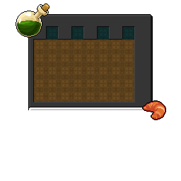
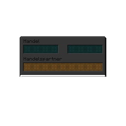

# GUI

Für manche Inventare werden eigene Overlays genutzt, um Slots zu verstecken oder Beschriftungen anzupassen. Dafür wird mit Hilfe der
`CustomModelData` ein eigenes Model für das Inventar-Item definiert. Diese Model hat eine eigene Textur. Diese Textur ist größer als
die Slot-Grenze in einem Inventar und überschreibt somit die Textur des gesamten Inventars.

| Inventar   | Minecraft-Item             | CustomModelData |             Textur             |
|------------|----------------------------|:---------------:|:------------------------------:|
| pocket     | `green_stained_glass_pane` |        1        |      |
| trading    | `green_stained_glass_pane` |        2        |     |
| arrow_up   | `green_stained_glass_pane` |       101       |    |
| arrow_down | `green_stained_glass_pane` |       102       |  |
