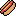
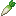

# Items

Item-Texturen basieren auf `CustomModelData`. Als Basis dient bei jedem Item ein anderes Minecraft Item, dessen Textur in Abhängigkeit
der `CustomModelData` angepasst wurde.

## Beispiel

In diesem Beispiel wird die Textur des Minecraft Karotten-Items verwendet. Das Model des Items wird jedoch durch ein anderes Model
ersetzt, wenn das `CustomModelData`-Tag des Items den Wert 1 hat.

Datei: `assets/minecraft/models/item/carrot.json`

```json
{
  "parent": "minecraft:item/generated",
  "textures": {
    "layer0": "minecraft:item/carrot"
  },
  "overrides": [
    { "predicate": { "custom_model_data": 1 }, "model": "runicroots:food/radish" }
  ]
}
```

Statt des Standard-Models mit der Karotten-Textur wird hier das Model `runicroots:food/radish` verwendet. Dieses Model ist in der Datei
`assets/runicroots/models/food/radish.json` definiert.

Datei: `assets/runicroots/models/food/radish.json`

```json
{
  "parent": "minecraft:item/generated",
  "textures": {
    "layer0": "runicroots:food/radish"
  }
}
```

Das Model `runicroots:food/radish` verwendet die Textur `runicroots:food/radish`. Diese Textur ist in der Datei
`assets/runicroots/textures/food/radish.png` definiert. Dadurch wird die Karotten-Textur durch die Rettich-Textur ersetzt, wenn die
`CustomModelData` den Wert 1 hat.

```{attention} Eigene Texturen müssen im [Texturen Atlas](https://minecraft.fandom.com/wiki/Texture_atlas) hinterlegt werden.
```

## Texturen

### Nahrung

| Item      | Minecraft-Item | CustomModelData |             Textur              |
|-----------|----------------|:---------------:|:-------------------------------:|
| Käse      | `pumpkin_pie`  |        1        |     |
| Donut     | `cookie`       |        1        |      |
| Spiegelei | `egg`          |        1        |  |
| Hotdog    | `bread`        |        1        |     |
| Rettich   | `carrot`       |        1        |     |
