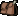

# Symbole

Manche Texturen werden als Unicode-Symbole verwendet, um diese im Chat anzeigen zu können. Dafür wird eine Textur für einen bestimmten
Unicode gesetzt. Wenn dieser Unicode im Chat verwendet wird, erscheint die Textur.

Die Texturen werden in der Datei `assets/minecraft/font/default.json` definiert. Ein Eintrag für ein Symbol sieht wie folgt aus:

```json
{
  "type": "bitmap",
  "file": "runicroots:font/coins/gold.png", // Pfad zur Textur
  "ascent": 8, // Verschiedbung auf der y-Achse
  "height": 8, // Höhe
  "chars": [
    "\uE002" // Unicode-Symbole, die überschrieben werden soll
  ]
}
```
## Texturen

| Unicode  | Textur                                    |  ascent  |  height  |                    Textur                    |
|----------|-------------------------------------------|:--------:|:--------:|:--------------------------------------------:|
| `\uE001` | `runicroots:font/houses/gryffindor_8.png` |    8     |    8     |  |
| `\uE002` | `runicroots:font/houses/hufflepuff_8.png` |    8     |    8     |  |
| `\uE003` | `runicroots:font/houses/ravenclaw_8.png`  |    8     |    8     |   |
| `\uE004` | `runicroots:font/houses/slytherin_8.png`  |    8     |    8     |   |
| `\uE005` | `runicroots:font/coins/gold.png`          |    8     |    8     |           |
| `\uE006` | `runicroots:font/coins/green.png`         |    8     |    8     |          |
| `\uE007` | `runicroots:font/coins/silver.png`        |    8     |    8     |         |
| `\uE008` | `runicroots:font/meat_leg.png`            |    8     |    8     |             |
| `\uE009` | `runicroots:font/meat_leg_half.png`       |    8     |    8     |        |
| `\uE00A` | `runicroots:font/heart_red.png`           |    8     |    8     |            |
| `\uE00B` | `runicroots:font/heart_red_half.png`      |    8     |    8     |       |
| `\uE00C` | `runicroots:font/heart_yellow.png`        |    8     |    8     |         |
| `\uE00D` | `runicroots:font/heart_yellow_half.png`   |    8     |    8     |    |
| `\uE00E` | `runicroots:font/pocket.png`              |    12    |    16    |               |

